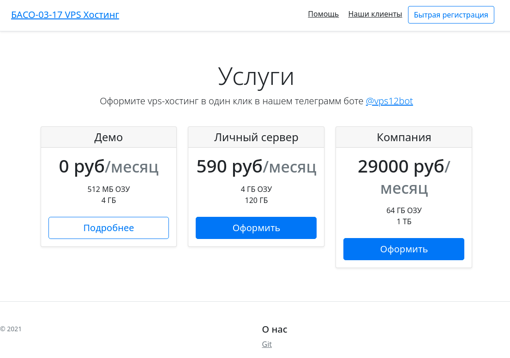
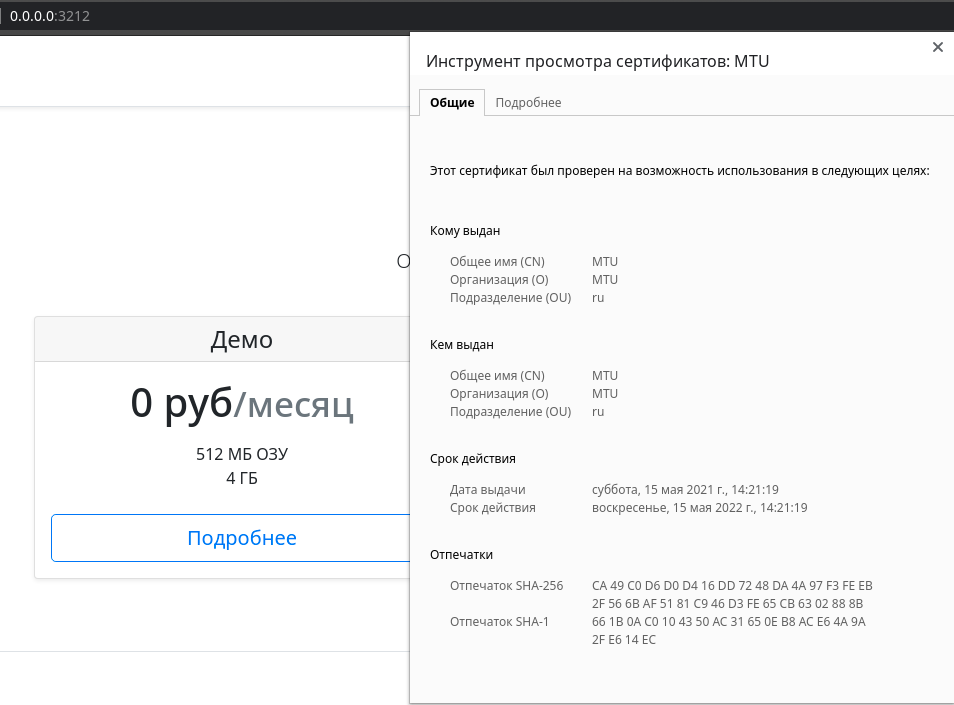

# Site for VPS-hosting (support)

## Установка зависимостей pip  
```sh
pip install -r requirements.txt
```  

### Прочие зависимости 
```sh
python=>3.6
sqlite3=>3.35.5
postgresql=>10
openssl (опционально)
```  


### Запуск HTTP
```sh
git clone https://github.com/rombintu/project12.git
cd project12/site
cp .env.bak .env
python3 -m flask run 
```

### Запуск HTTPS
```sh
git clone https://github.com/rombintu/project12.git
cd project12/site
cp .env.bak .env
openssl req -x509 -newkey rsa:4096 -nodes -out cert.pem -keyout key.pem -days 365
python3 -m flask run --cert=cert.pem --key=key.pem 
```

### Прочее
* [Подробнее об HTTPS](https://blog.miguelgrinberg.com/post/running-your-flask-application-over-https)